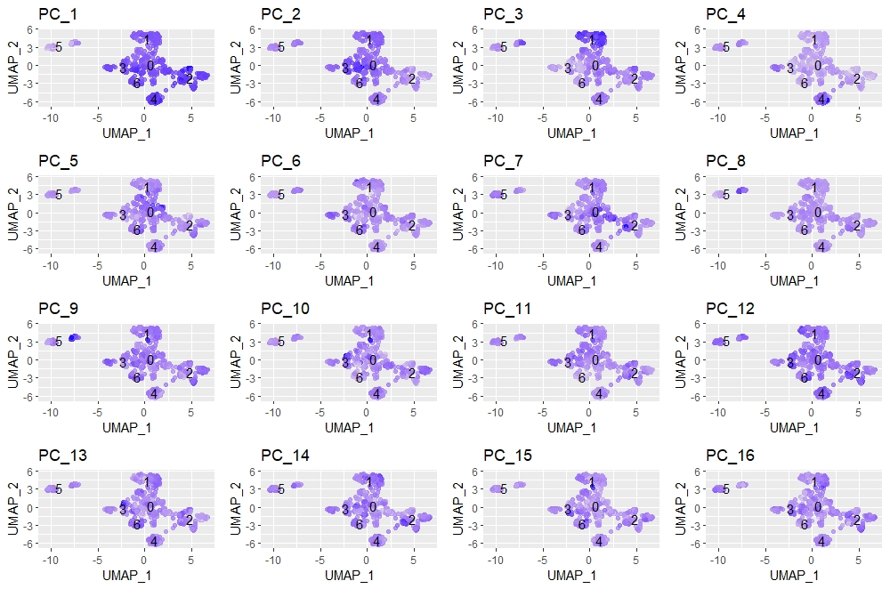

```{r setup, include=FALSE }
knitr::opts_chunk$set(echo = TRUE,message = FALSE, warning = FALSE)
library(prettydoc)
library(dplyr)
library(Seurat)
library(Matrix)
library(tidyverse)

  # theme: readable

```


## 1. Raw Data Pocessing
This goal is to generate a count matrix from the raw data files (.bcl or .fastq). It usually includes the following steps: 

* Formatting reads and filtering noisy (failed) cell barcodes 
* Demultiplexing sample reads(if sequencing more than one sample)
* Mapping to transcriptome
* Collapsing UMIs and quantification of reads
    
There are several command-line tools for raw data processing. **CellRanger** pipeline is  commonly used for 10X Genomics datasets. The resulting output is a cell by gene matrix of counts, with each row being one cell and each column being one gene (feature).


## 2. Data import 

First we import the data from CellRanger output, usually in a folder of "feature_bc_matrix" containing three different files (barcodes.tsv, features.tsv, and matrix.mtx.) for each sample. We will use an R package called [Seurat](https://www.cell.com/cell/fulltext/S0092-8674(19)30559-8) to run the analysis . 

```{r}
WT_SHAM.data <- Read10X(data.dir = "../raw/WT-SHAM/")
WT_SHAM <- CreateSeuratObject(counts=WT_SHAM.data,project = "Heart2019",
                              min.cells = 3,min.features = 200)

WT_MI.data <- Read10X(data.dir="../raw/WT-MI/")
WT_MI <- CreateSeuratObject(counts=WT_MI.data,project = "Heart2019",
                            min.cells = 3,min.features = 200)

KO_SHAM.data <- Read10X(data.dir="../raw/KO-SHAM/")
KO_SHAM <- CreateSeuratObject(counts=KO_SHAM.data,project = "Heart2019",
                              min.cells = 3,min.features = 200)

KO_MI.data <- Read10X(data.dir = "../raw/KO-MI/")
KO_MI <- CreateSeuratObject(counts=KO_MI.data,project = "Heart2019",
                            min.cells = 3,min.features = 200)


```


When creating the Seurat object, there is information about the data stored in meta.data slot within the Seurat object. We could also add custom information (group, quality check stats) as new columns into the metadata. Here we are adding sample (group) name to the metadata for visualization purposes, and then merge all the samples into one Seurat object to make it easier for QC steps and compare data quality. We are going to take a look at the cell count first for all the samples.

```{r}
#adding column to metadata
WT_SHAM$sample <- sample("WT_SHAM", size = ncol(WT_SHAM), replace = TRUE)
WT_MI$sample <- sample("WT_MI", size = ncol(WT_MI), replace = TRUE)
KO_MI$sample <- sample("KO_MI", size=ncol(KO_MI),replace = TRUE)
KO_SHAM$sample <- sample("KO_SHAM", size = ncol(KO_SHAM),replace=TRUE)

##merged datasets to a single Seurat object
merged_MI_all <- merge(x=WT_SHAM, y=c(WT_MI, KO_SHAM, KO_MI),
                   add.cell.id = c("WT_SHAM", "WT_MI", "KO_SHAM","KO_MI"))

##extract metadata from the object  
metadata_all <- merged_MI_all@meta.data

##Visualize cell count for each sample 
metadata_all %>% 
  ggplot(aes(x=sample, fill=sample)) + 
  geom_bar() +
  theme_classic() +
  theme(axis.text.x = element_text(angle = 45, vjust = 1, hjust=1)) +
  theme(plot.title = element_text(hjust=0.5, face="bold")) +
  ggtitle("NCells")

```

We can see that the WT_SHAM has a particularly low cell count. As some of the steps later on would not work for such few cells, we will look at WT_MI and KO_MI for now.

## 3. Quality Metrics

As mentioned before, Seurat automatically creates some metadata for each cells. Here are how the metadata looks like now (first few rows, note the "sample" column was added in the previous step):
```{r}
head(metadata_all[metadata_all$sample=="WT_MI",])

```


The columns are

* orig.ident: default to project as we had assigned it
* nCount_RNA: number of UMIs per cell
* nFeature_RNA: number of genes detected per cell
  
We need to calculate some additional metrics:

* number of genes detected per UMI: an estimate for the complexity of our dataset (more genes detected per UMI, more complex our data)
* mitochondrial ratio: a percentage of cell reads originating from the mitochondrial genes, which is usually quite low in normal cells (<0.2)

```{r eval=FALSE}
#rename columns
metadata <- metadata %>%
  dplyr::rename(seq_folder = orig.ident,
                nUMI = nCount_RNA,
                nGene = nFeature_RNA)

#load mitochondrial genes (mouse)
load("data/mito_gene_name_mouse.rdata")

#extract the counts from the merged Seurat object
counts <- GetAssayData(merged_MI, slot = "counts")

##Number of UMIs assigned to mitochondrial genes
metadata$mtUMI <- 
Matrix::colSums(counts[which(rownames(counts) %in% mt),], na.rm = T)

# Calculate of mitoRatio per cell
metadata$mitoRatio <- metadata$mtUMI/metadata$nUMI

#add number of genes per UMI for each cell
metadata$log10GenesPerUMI <- 
  log10(metadata$nGene) / log10(metadata$nUMI)
```
Now the metadata looks like this, with the extra columns of our calculations. (Some columns are renamed for easier visualization.)
```{r echo=FALSE}
load("../data/merged_MI.Rdata")
#only contains WT_MI, KO_MI

metadata <- merged_MI@meta.data

head(metadata)
```


Then we could assess the quality metrics with some visualization. (We will show cell count here again, as an important quality metrics.)

### 3.1 Cell Count

The cell counts are determined by the number of unique cellular barcodes detected. Ideally, results are better with >10k cells (in 3'-end sequencing). It depends on how many cells are loaded and capture efficiency (50-60% in 10x method). Sometimes it's also possible to have more cellular barcodes than cells.

```{r}
metadata %>% 
  ggplot(aes(x=sample, fill=sample)) + 
  geom_bar() +
  theme_classic() +
  theme(axis.text.x = element_text(angle = 45, vjust = 1, hjust=1)) +
  theme(plot.title = element_text(hjust=0.5, face="bold")) +
  ggtitle("NCells")
```


### 3.2 UMI counts (transcripts) per cell


The UMI counts per cell should generally be above 500. UMI counts between 500-1000 are usable, but it's recommended to sequence the cells more deeply.

```{r}
metadata %>% 
  ggplot(aes(color=sample, x=nUMI, fill= sample)) + 
  geom_density(alpha = 0.2) + 
  scale_x_log10() + 
  theme_classic() +
  ylab("Cell density") +
  geom_vline(xintercept = 500)
```

### 3.3 Genes detected per cell

The expected counts may be lower than UMIs, and we set it as 300 here. For high quality data, the proportional histogram should contain a single large peak that represents cells that were encapsulated.
```{r}
metadata %>% 
  ggplot(aes(color=sample, x=nGene, fill= sample)) + 
  geom_density(alpha = 0.2) + 
  theme_classic() +
  scale_x_log10() + 
  geom_vline(xintercept = 300)

```


### 3.4 Mitochondrial counts ratio

When the distribution of mitochondrial gene expression detected per cell is high, it usually means there's a large amount of mitochondrial contamination from dead or dying cells. Here we define poor quality samples for mitochondrial counts as cells with more than 20% mitochondrial counts.

```{r}
metadata %>% 
  ggplot(aes(color=sample, x=mitoRatio, fill=sample)) + 
  geom_density(alpha = 0.2) + 
  scale_x_log10() + 
  theme_classic() +
  geom_vline(xintercept = 0.2)

```

### 3.5 UMIs vs. genes detected

Here we are looking at three quality metrics together by plotting the number of genes versus the numnber of UMIs coloured by the fraction of mitochondrial reads. Cells of poor quality are likely to have low genes and UMIs per cell (bottown left of the plot), whereas good quality cells will exhibit higher number of genes and UMIs per cell (top right). Most of the time, the mitochondrial counts ratio are only high in the low count cells with few detected genes.

```{r}
metadata %>% 
  ggplot(aes(x=nUMI, y=nGene, color=mitoRatio)) + 
  geom_point() + 
  scale_colour_gradient(low = "gray90", high = "black") +
  stat_smooth(method=lm) +
  scale_x_log10() + 
  scale_y_log10() + 
  theme_classic() +
  geom_vline(xintercept = 500) +
  geom_hline(yintercept = 250) +
  facet_wrap(~sample)
```


### 3.6 Complexity


Generally the complexity of the gene expression (genes detected per UMI) is higher than 0.8, as the sequencing for any give gene has not been saturated. Outliers might indicate low complexity cell types like red blood cells.

```{r}
metadata %>%
  ggplot(aes(x=log10GenesPerUMI, color = sample, fill=sample)) +
  geom_density(alpha = 0.2) +
  theme_classic() +
  geom_vline(xintercept = 0.8)

```


After looking at the quality metrics, we could start cell-level and gene-level filtering. It's recommended to consider the joint effects of these metrics when setting thresholds and set them as permissive as possible. 
(Because of the low cell count in our data, we won't filter anything out for now.)


## 4. Normalization

The counts of mapped reads for each gene is proportional to the expression of RNA as well as many other factors (e.g. sequence depth, gene length). Normalization is the process of scaling raw count values to account for the non-expression factors, so that the expression levels are more comparable between and/or within cells.


### 4.1 Cell cycle scoring

Before performing the sctransform method for normalization, it is recommended to check whether cell cycle phase is a major source of variation that needs regressing out. For this step, we do a rough normalization by dividing by total counts per cell and taking the natural log. It is not as accurate as the sctransform method that we will use to identify cell clusters, but it is sufficient to explore sources of variation in our data.
After the data is normalized for sequencing depth, we can assign each cell a score based on its expression of G2/M and S phase markers, followed by identification of the most variable genes, scaling the data, and PCA analysis.

```{r eval=FALSE}
load("data/cell_cycle_mouse.rdata")

s_genes <- cell_cycle_markers %>%
  dplyr::filter(phase == "S") %>%
  pull("gene_name")

g2m_genes <- cell_cycle_markers %>%
  dplyr::filter(phase == "G2/M") %>%
  pull("gene_name")


merged_MI_phase <- NormalizeData(merged_MI) %>% 
  CellCycleScoring(g2m.features = g2m_genes, 
                   s.features = s_genes) %>% 
  FindVariableFeatures(selection.method = "vst",
                       nfeatures = 2000, 
                       verbose = FALSE) %>% 
  ScaleData() %>% 
  RunPCA() 
```
```{r echo=FALSE}
load("../data/merged_MI_phase.rdata")

DimPlot(merged_MI_phase,
        reduction = "pca",
        group.by = "Phase",
        split.by = "Phase")
```


Overall, we do not see large differences due to cell cycle phase based on this plot of top PCs, and therefore we would not regress out the variation due to cell cycle.


### 4.2 SCTransform
Now we can use the sctransform method as a more accurate method of normalizing, estimating the variance of the raw filtered data, and identifying the most variable genes. By default, sctransform accounts for cellular sequencing depth, or nUMIs.

```{r eval=FALSE, include=FALSE}
# Split seurat object by condition to perform cell cycle scoring and SCT on all samples
split_MI <- SplitObject(merged_MI, split.by = "sample")

split_MI <- split_MI[c("WT_MI", "KO_MI")] %>%  
  map(~.x %>% 
        NormalizeData() %>% 
        CellCycleScoring(g2m.features = g2m_genes, 
                         s.features = s_genes) %>% 
        SCTransform(verbose=FALSE))
```


### 4.3 Integration

If we are dealing with more than one group (condition) of samples, integration samples using shared highly variable genes can greatly improve the downstream clustering and analysis. Oftentimes, when clustering cells from multiple conditions there are condition-specific clusters and integration can help ensure the same cell types cluster together.
In our case, we have two groups of data: WT and KO. To decide whether we need to perform integration, we could perform the normalization on both conditions together in a Seurat object and visualize the similarity between cells (clustering). Here is what we see:

```{r eval = FALSE}
merged_MI_no_integ <- NormalizeData(merged_MI) %>%
  FindVariableFeatures(selection.method = "vst",
                       nfeatures = 2000, verbose = FALSE) %>%
  ScaleData() %>%
  RunPCA() %>%
  FindNeighbors(dims = 1:20) %>%
  FindClusters(resolution = 0.6) %>%
  RunUMAP(dim=1:20)

DimPlot(merged_MI_no_integ,
        reduction = "umap", group.by = "sample")
```
```{r echo=FALSE}
load("../data/merged_MI_no_integ.rdata")

DimPlot(merged_MI_no_integ, 
        reduction = "umap", group.by = "sample")
```


Based on the condition-specific clustering, it's recommended to include integration before analysis, so that the cell types of one condition/dataset align with the same celltypes of the other conditions/datasets.

Integration includes the following steps:

* Canonical correlation analysis (CCA): identifies shared sources of variation between the conditions/groups (a form of PCA).
* Identify anchors or mutual nearest neighbors (MNNs) across datasets
* Integrate the condition/datasets

Now we could use our SCTransform-normalized data to select the most variable genes and perform integration.


```{r eval=FALSE }
# Select the most variable features to use for integration
integ_features <- SelectIntegrationFeatures(object.list = split_MI,
                                            nfeatures = 3000)

# Prepare the SCT list object for integration
split_MI <- PrepSCTIntegration(object.list = split_MI,
                                 anchor.features = integ_features)

# CCA: Find best buddies - can take a while to run
integ_anchors <- FindIntegrationAnchors(object.list = split_MI,
                                        normalization.method = "SCT",
                                        anchor.features = integ_features,
                                        verbose=FALSE)

# Integrate across conditions
MI_integrated <- IntegrateData(anchorset = integ_anchors,
                                  normalization.method = "SCT",
                                  verbose=FALSE)
```


After integration, we could visualize the data by dimensionality reduction techniques, such as PCA and Uniform Manifold Approximation and Projection (UMAP). *While PCA will determine all PCs, we can only plot two at a time. In contrast, UMAP will take the information from any number of top PCs to arrange the cells in this multidimensional space. It will take those distances in multidimensional space, and try to plot them in two dimensions. In this way, the distances between cells represent similarity in expression.*

* PCA plot after integration:

```{r eval=FALSE}
MI_integrated<- RunPCA(object = MI_integrated,verbose = FALSE) %>% 
  RunUMAP(MI_integrated,
          dims = 1:30,
          reduction = "pca")

PCAPlot(MI_integrated,
        split.by="sample")

```
```{r echo=FALSE}
load("../results/integrated_MI.rdata")

PCAPlot(MI_integrated,
        split.by="sample")
```


Despite the cell count difference, We can see that we have a good overlay of both conditions by PCA.

* UMAP plot after integration:

```{r}
DimPlot(MI_integrated,
        reduction = "umap", 
        group.by = "sample")
```


Again, we see good alignment of the two conditions (very different from the unintegrated UMAP plot.)


## 5. Clustering cells based on top PCs

### 5.1 Identify significant PCs
Determining how many PCs to include in the clustering step is therefore important to ensure that we are capturing the majority of the variation (cell types) present in our dataset.

Elbow plot is a useful way to determine how many PCs to use for clustering. The elbow plot visualizes the standard deviation of each PC, and we are looking for where the standard deviations begins to plateau (where the elbow appears).

The elbow plot of the top 40 PCs:
```{r}
ElbowPlot(object = MI_integrated, ndims = 40)

```
Based on this plot, we could roughly determine the majority of the variation by where the elbow occurs around PC10. With the improved accuracy of SCTransform, selection of PCs is less important than it used to be in previous Seurat version. In theory, with SCTransform, the more PCs we choose the more variation is accounted for when performing the clustering, but it take a lot longer to perform the clustering. Here we will use first 30 PCs to generate the clusters.

### 5.2 Cluster the cells

In the function to perform the graph-based clustering, the resolution is an important argument that sets the “granularity” of the downstream clustering and will need to be optimized for every individual experiment. For datasets of 3,000 - 5,000 cells, the resolution set between 0.4-1.4 generally yields good clustering. Increased resolution values lead to a greater number of clusters, which is often required for larger datasets.

```{r}

MI_integrated <- FindNeighbors(object = MI_integrated, 
                                  dims = 1:30) %>% 
  FindClusters(resolution=0.8)


```


To visualize the cell clusters, the most popular methods include t-distributed stochastic neighbor embedding (t-SNE) and UMAP techniques. Here we will use UMAP for visualization of the clusters.

```{r}

DimPlot(MI_integrated,
        reduction = "umap",
        label = TRUE,
        split.by = "sample")

```

As shown above, we could split the plot by sample to confirm there's no segregation of clusters by sample. Similarly, we could also check if the cells cluster by the different cell cycle phases. If there is, we would want to re-run the SCTransform and regress out variation due to cell cycle phase, then re-run the rest of the steps.

```{r}
DimPlot(MI_integrated,
        reduction = "umap",
        split.by = "Phase") + NoLegend()
```

We do not see much clustering by cell cycle score.


### 5.3 how PCs drive different clusters

We can also explore how well our clusters separate by the different PCs; we hope that the defined PCs separate the cell types well. To visualize this information, we need to extract the UMAP coordinate information for the cells along with their corresponding scores for each of the PCs to view by UMAP.

```{r eval=FALSE}
# Defining the information in the seurat object of interest
columns <- c(paste0("PC_", 1:16),
             "ident",
             "UMAP_1", "UMAP_2")

# Extracting this data from the seurat object
pc_data <- FetchData(MI_integrated, 
                     vars = columns)

# Adding cluster label to center of cluster on UMAP
umap_label <- FetchData(MI_integrated, 
                        vars = c("ident", "UMAP_1", "UMAP_2"))  %>%
  group_by(ident) %>%
  summarise(x=mean(UMAP_1), y=mean(UMAP_2))

# Plotting a UMAP plot for each of the PCs
library(cowplot)
map(paste0("PC_", 1:16), function(pc){
  ggplot(pc_data, 
         aes(UMAP_1, UMAP_2)) +
    geom_point(aes_string(color=pc), 
               alpha = 0.7) +
    scale_color_gradient(guide = FALSE, 
                         low = "grey90", 
                         high = "blue")  +
    geom_text(data=umap_label, 
              aes(label=ident, x, y)) +
    ggtitle(pc)
}) %>% 
  plot_grid(plotlist = .)
```

  
 
 
So it looks like the genes driving PC_2 exhibit higher expression in clusters 3; Similarly, PC_3 contributes most to cluster 1; PC_4 is represented most in cluster 4. 

We could look back at our genes driving this PC to get an idea of what the cell types might be:
 
```{r}
print(MI_integrated[["pca"]], dims = 1:5, nfeatures = 5)
```
 
With the Il1b, Cd52, Cxcl2 genes as positive markers of PC_2, we can hypothesize that cluster 3 corresponds to macrophages. The high representation of hemoglobins (PC_3: Hbb-bs, Hba-a1, Hba-a2) in cluster 1 is likely to indicate that cluster 1 is erythrocytes.

To determine the identity of the clusters, we are going to explore several known markers for the cell types expected. 


## 6. Identification of cell types

### 6.1 Explore known cell type markers

For non-myocyte cardiac cells, we expect to have endothelial cells, hematopoietic-derived cells, fibroblasts, vascular smooth muscle cells, and other mesenchymal cells. Now we can explore the markers for each of these cell types.

```{r}
# Select the RNA counts slot to be the default assay
DefaultAssay(MI_integrated) <- "RNA"

# Normalize RNA data for visualization purposes
MI_integrated <- NormalizeData(MI_integrated, verbose = FALSE)
```


#### Endothelial cells (ECs): 

```{r}
##CD31 and CD102 (gene Pecam1, Icam2)
FeaturePlot(MI_integrated, 
            reduction = "umap", 
            features = c("Pecam1","Icam2"), 
            sort.cell = TRUE,
            min.cutoff = 'q10', 
            label = TRUE)
```

We can see that cluster 5 may be ECs.


#### Mesenchymal cells (fibroblast, VSMC, mural cells)

* VSMC: Cxcl12,Eln,Fbln5
* Fibroblasts: Col1a2, Col3a1, Fbln2, Sparc
* Others: Postn,Vcan

```{r}
FeaturePlot(MI_integrated, 
            reduction = "umap", 
            features = c("Cxcl12","Eln","Fbln5","Postn","Vcan"), 
            sort.cell = TRUE,
            min.cutoff = 'q10', 
            label = TRUE)

FeaturePlot(MI_integrated,
            reduction = "umap",
            features = c("Col1a2","Col3a1","Fbln2","Sparc" ),
            sort.cell = TRUE,
            min.cutoff = 'q10',
            label = TRUE)

```

So it looks like cluster 5 includes ECs, VSMC and other mesenchymal cells.


#### Erythrocytes

```{r}
#Hemoglobin (gene Hbb, Hba)
FeaturePlot(MI_integrated, 
            reduction = "umap", 
            features = c("Hbb-bs", "Hba-a1", "Hba-a2"), 
            sort.cell = TRUE,
            min.cutoff = 'q10', 
            label = TRUE)

```

The markers further supports the hypothesis that cluster 1 is red blood cells.


#### Leukocytes

```{r}
#CD45, LYZ (gene Ptprc LyzM)
FeaturePlot(MI_integrated, 
            reduction = "umap", 
            features = c("Ptprc", "Lyz2"), 
            sort.cell = TRUE,
            min.cutoff = 'q10', 
            label = TRUE)

```

This suggests that cluster 0, 2, 3, 4, 6 all seem to be leukocytes. Next we are going to take a closer look into different types of leukocytes. Reference of the markers included is linked here(https://www.ahajournals.org/doi/full/10.1161/CIRCRESAHA.117.312509).


#### Macrophages


* Inflammatory macrophages:

```{r}
#Cd11b (Itgam); 
FeaturePlot(MI_integrated, 
            reduction = "umap", 
            features = c("Cd14","Ly6c2", "Itgam","Adgre1"), 
            sort.cell = TRUE,
            min.cutoff = 'q10', 
            label = TRUE)

VlnPlot(MI_integrated,
features = c("Il1b","Ly6c2","Adgre1"))

```


* Resident macrophages:

```{r}
#Ccr2 as infiltrating macrophage marker
FeaturePlot(MI_integrated, 
            reduction = "umap", 
            features = c("F13a1","Pf4","Ccr2"), 
            sort.cell = TRUE,
            min.cutoff = 'q10', 
            label = TRUE)
```


Based on the plots above, cluster 3 contains inflammatory macrophages (curiously with low Adgre1 expression) and cluster 2 contains resident macrophages (note the minimal expression of Ccr2 as recruited macrophage marker).


#### Dendritic cells (DCs)

```{r}
FeaturePlot(MI_integrated,
            reduction = "umap",
            features = c("Cd74","H2-Eb1"),
            sort.cell = TRUE,
            min.cutoff = 'q10',
            label = TRUE)

```

Based on the plot above, cluster 0 may correspond to DCs. However, based on the high Cd14 and Ly6c2 expression in cluster 0, it might also contain monocytes.

Some of the DC markers, as well as markers for T cell, B cell and megakaryocyte are not included because of the low expression. 


### 6.2 Find conserved markers in all conditions

To have a better idea of what some of the cell clusters represent (especially for the ones without highly-expressing known markers), we are going to identify markers in all the clusters. When we have samples representing different conditions in our dataset, our best option is to find **conserved** markers. This analysis compares each cluster against all others and outputs the genes that are differentially expressed/present across all conditions. ALternatively, when we don't have enough cells, or only want to improve confidence in hypothesized cell types, we could use another function to find **all** markders for each cluster (but this is typically recommended for single sample analysis).

Generally we will run the analysis for unidentified clusters, otherwise it might take very long. But in our case, the low cell count allow us to run all clusters without too much trouble. We will show here the top 10 markers for each cluster.


```{r}
# Create function to get conserved markers for any given cluster
load("../data/gene_annotations_mouse.rdata")

get_conserved <- function(cluster){
  FindConservedMarkers(MI_integrated,
                       ident.1 = cluster,
                       grouping.var = "sample",
                       only.pos = TRUE) %>%
    rownames_to_column(var = "gene") %>%
    left_join(y = unique(annotations[, c("gene_name", "description")]),
              by = c("gene" = "gene_name")) %>%
    mutate(cluster_id = cluster)
}

conserved_markers <- map_dfr(c(0:6), get_conserved)

# Extract top 10 markers per cluster
top10 <- conserved_markers %>% 
  mutate(avg_fc = (WT_MI_avg_logFC + KO_MI_avg_logFC) /2) %>% 
  group_by(cluster_id) %>% 
  top_n(n = 10, 
        wt = avg_fc)

top10
```

As shown above, the output is a matrix containing a ranked list of putative markers listed by gene ID for the cluster we specified, and associated statistics. Some of the columns are described below:

* **gene**: gene symbol
* **condition_p_val**: p-value not adjusted for multiple test correction for condition
* **condition_avg_logFC**: average log2 fold change for condition. Positive values indicate that the gene is more highly expressed in the cluster.
* **condition_pct.1**: percentage of cells where the gene is detected in the cluster for condition
* **condition_pct.2**: percentage of cells where the gene is detected on average in the other clusters for condition
* **condition_p_val_adj**: adjusted p-value for condition, based on bonferroni correction using all genes in the dataset, used to determine significance
* **max_pval**: largest p value of p value calculated by each group/condition
* **minimump_p_val**: combined p value

*Note that since each cell is being treated as a replicate this will result in inflated p-values within each group.*

When looking at the output, it's recommended to look for markers with large differences in expression between pct.1 and pct.2 and larger fold changes. Also, the majority of cells expressing the marker should be in our cluster of interest. If pct.1 is low, such as 0.3, it may not be as interesting.

We could clean the matrix a little bit for easier visualization.

```{r}
top10_filter <- top10 %>% 
  filter(KO_MI_pct.1>0.3) %>% 
  select(1,14,15,4,5,9,10)

top10_filter
```

For cluster 0, although there don't seem to be a lot of markers with good fold changes and cell percentages, but C1q supports the presense of monocytes, and Dab2 and H2-Ab1 (together with Cd74) support our previous observation that it contains DCs. 

Most of the markers for cluster 1, 2, and 3 also turn out consistent with our identification using known markers.

For cluster 4, Ifit2, Ifit3 and Rsad2 point to the direction of granulocytes, and there are evidence suggesting that Cxcl10 and Ccl4 are produced by neutrophils and eosinphils under proinflammatory conditions.

For cluster 6, Saa3, Arg1 and Folr2 are good markers. In mice, Saa3 is mainly synthesized by extrahepatic cells, such as adipocytes and macrophages in response to inflammation. Folr2 is considered a marker for M2-polarized macrophages. Arg1 is found to be expressed in macrophages polarized toward immunosuppressive phenotype. Furthermore, cluster 6 also has minimal expression of proinflammatory cytokine Il1b. Therefore, it's likely that cluster 6 correspond to M2-polarized macrophages.


```{r}
VlnPlot(MI_integrated, 
            features = c("Saa3","Arg1","Folr2"))

```


Now we can rename the clusters:

```{r}
MI_integrated <- RenameIdents(object = MI_integrated,
                              "0"="Dendritic cells/Monocytes",
                              "1"="Erythrocytes",
                              "2"="Resident macrophages",
                              "3"="Inflammatory macrophages",
                              "4"="Granulocytes",
                              "5"="Endothelial cells/Mesenchymal cells",
                              "6"="M2-polarized macrophages")

DimPlot(object = MI_integrated,
        reduction = "umap",
        label = T,
        label.size = 3,
        repel = T)
```

Now we can briefly look at the number/proportion of cells identified in each sub-population.

```{r}
# Extract identity and sample information from seurat object to determine the number of cells per cluster per sample
n_cells <- FetchData(MI_integrated, 
                     vars = c("ident", "sample")) %>%
  dplyr::count(ident, sample) %>% 
  group_by(sample) %>% 
  mutate(percentage=  n/sum(n)*100)  %>%
  ungroup() %>%
  mutate_if(is.numeric,~round(.x,0) ) %>% 
  mutate(percentage = paste0(percentage," %"),
         n = as.character(n)) %>% 
  pivot_longer(cols = c(n, percentage), names_to = "cell_count") %>% 
  pivot_wider(names_from = ident, values_from = value) 


n_cells

```

Going forward, we could perform differential expression or gene set enrichment analysis within one or several cluster subset(s), further defining the transcriptomic profiles in different cell types (cytokine etc.). This will allow us to better compare the different groups, and narrow down the possible signaling pathways involved. 
